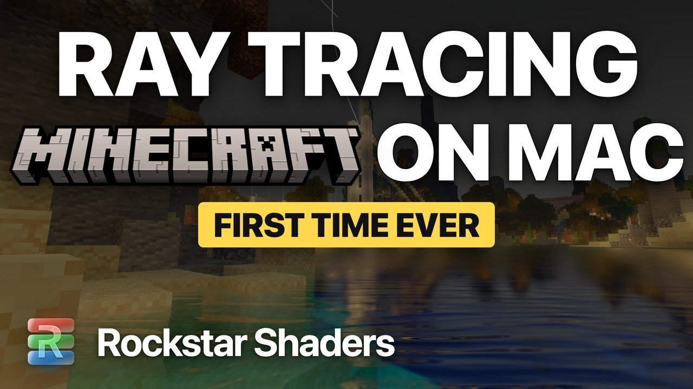
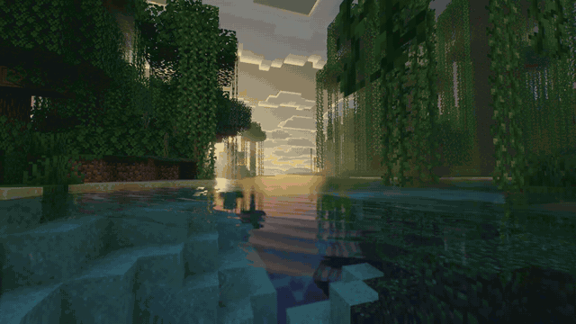
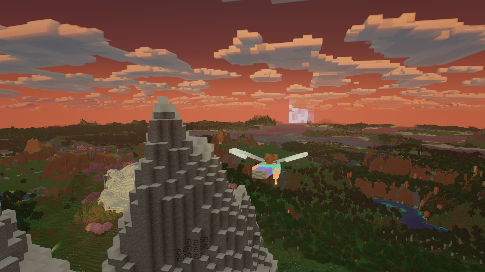
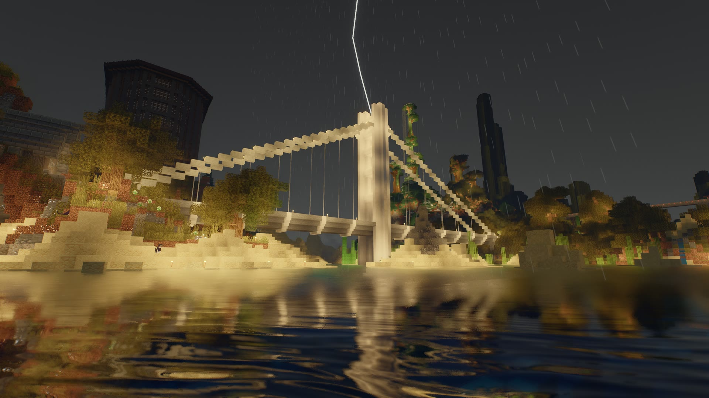
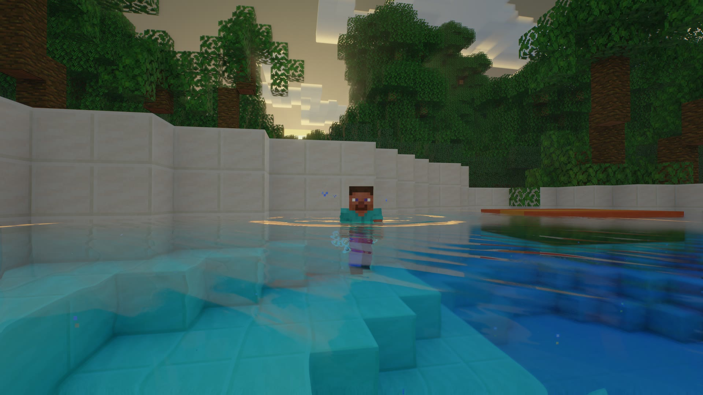
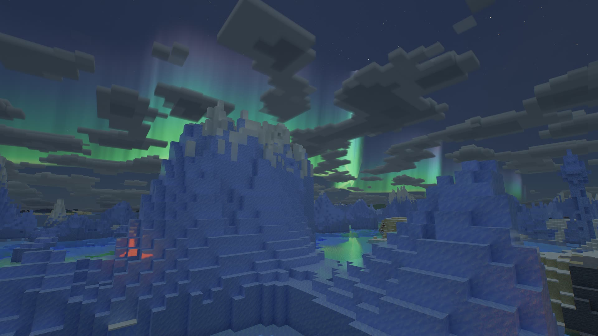
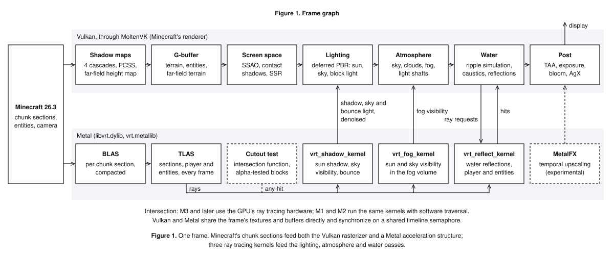
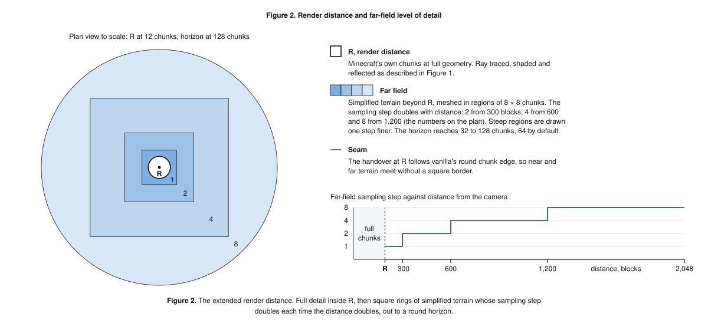
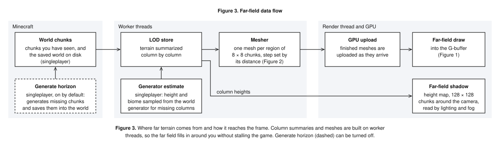
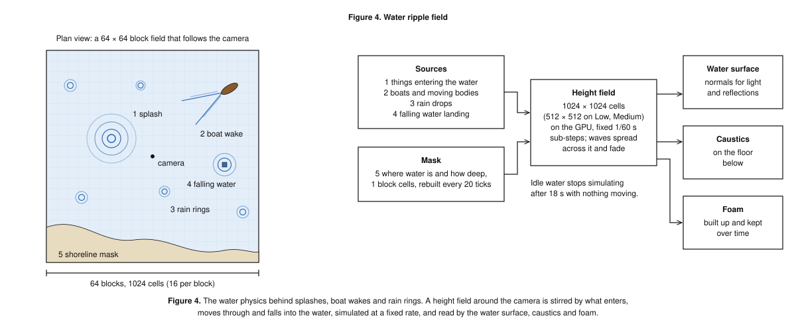

# Rockstar Shaders: ray tracing for Minecraft on Mac

Rockstar Shaders is a ray tracing shader mod for Minecraft Java Edition on Apple
Silicon Macs. It gives Minecraft a modern renderer built for modern Mac hardware:
ray-traced lighting, shadows and reflections, volumetric light, living water, real
skies and weather, traced on the GPU inside your Mac with Metal.

[Watch the launch film on YouTube](https://youtu.be/3XGQaTYL5oM), captured in the engine at 4K 60 fps.

Rockstar Shaders 1.0.0 is free. Download it from [rockstarshaders.com/download](https://rockstarshaders.com/download) or the
[Releases page](../../releases). [Modrinth](https://modrinth.com/mod/rockstarshaders) (pending approval). Website and help: [rockstarshaders.com](https://rockstarshaders.com).

## Install

You need:

- Minecraft Java Edition 26.3
- [Fabric Loader](https://fabricmc.net/use/installer/) 0.19.5 or newer and [Fabric API](https://modrinth.com/mod/fabric-api) for 26.3
- A Mac with Apple Silicon (M1 or later) on macOS 13 Ventura or newer. Java 25 comes with the game.

Then:

1. Install Fabric Loader and Fabric API for Minecraft 26.3.
2. Download `rockstarshaders-1.0.0.jar` from [rockstarshaders.com/download](https://rockstarshaders.com/download) or the [Releases page](../../releases) and drop it into your `.minecraft/mods/` folder.
3. Start the game. Say yes when it asks to switch Minecraft to Vulkan, then start it again.
4. In a world, press K for the settings. Hold C to zoom.

Rockstar Shaders replaces the same parts of the renderer as Sodium, Iris, Embeddium,
Nvidium, Distant Horizons and Voxy, so remove those first. If one is installed, it
steps aside and tells you why. Step-by-step help for every setting is at
[rockstarshaders.com/help](https://rockstarshaders.com/help/).

## Screenshots

All captured in the engine at 4K on an M4 Max MacBook Pro, from the launch film.

Flying with an elytra at sunset. The extended render distance draws the terrain all
the way to the horizon.

A thunderstorm over ScarLand. The lightning lights up the bridge, and the water
reflects it through the rain.

Landing in the pool. A ring of ripples spreads out from the splash, and drops fly
from the surface.

The northern lights over the ice spikes on a clear, cold night.

Maps: ScarLand (storm) and ScarWorld (pool) by GoodTimesWithScar.

## Overview

For years, Mac players have had some of the most capable graphics hardware in any
laptop or desktop and no way to use it in Minecraft. Classic shader packs are
written for OpenGL, which Apple stopped developing in 2018, and they cannot reach the
ray tracing hardware in newer Macs. Rockstar Shaders is built the other way around,
on Minecraft's own Vulkan renderer and Apple's Metal, so an M1 through M4 finally
gets to do what it was designed for.

Install one mod, say yes to Vulkan, and the whole game changes. Sunlight, sky light
and bounce light are ray traced against the real world, so shadows land where they
should and light carries the color of every surface it touches. Water is a
simulation, not a texture: jump in and it splashes, row a boat and a wake spreads
out behind you, and rain rings the surface. Light pours through windows and leaves
in visible shafts and takes on the color of stained glass. Sunsets are lit by a real
atmosphere, and the render distance reaches all the way to the horizon.

- Ray-traced sun shadows, sky light and one-bounce global illumination
- Ray-traced water reflections, screen-space reflections everywhere else, glass mirrors
- Water physics: a simulated ripple field with splashes, boat wakes and rain rings, waves, caustics, waterfalls and plunge pools
- Volumetric fog and light shafts, colored by stained glass
- Physically based atmosphere: sunsets, Minecraft's square clouds, stars, nebulae and a flowing aurora
- Weather by biome: rain and snow, dry under roofs and leaves, storms, lightning and snow on the leaves
- Colored block light with flickering flames, and dynamic light from the torch in your hand
- An extended render distance that draws terrain far past Minecraft's own limit
- Resource packs: custom entity models and animations, and LabPBR normal and specular maps
- Four quality profiles, a switch for every feature, and changes that apply live
- The Overworld, the Nether and the End

## Your Mac

| Chip | Ray tracing |
|---|---|
| M3, M4 and later | Metal hardware ray tracing |
| M1, M2 | The same kernels with software traversal |

On an M4 Max at 1728×1084, looking over the same lake, the GPU spends 20.8 ms a frame
on Low, 22.7 on Medium, 25.8 on High and 34.3 on Ultra, and the 1.0.0 performance
pass took about another 10% off Ultra. M1 and M2 Macs are slower; the first launch
picks a quality level for your chip.

## Good to know

- Generate horizon (singleplayer, on by default) fills in missing far terrain in the background and saves it into your world, about 24 KB per chunk. Turn it off on the Performance page before opening a world you want to keep untouched.
- Ray tracing, shadow maps and shadow resolution apply after a restart. Every other setting applies live.
- Depth of field is off by default, and MetalFX is experimental.
- On other platforms the mod loads but stays off.

## Reporting a bug

[Open an issue](../../issues/new/choose) with your `logs/latest.log`, your Mac and
chip, your quality profile and a screenshot with F3 on. For performance, add a
screenshot of the pass timings overlay from the settings. The Help and support
button in the settings brings you here too.

## Technical documentation

How the renderer works, in four figures. Every setting is explained at
[rockstarshaders.com/help](https://rockstarshaders.com/help/).

### The frame

Two engines share one Apple GPU. Minecraft's Vulkan renderer, running through
MoltenVK, draws the frame. A small native Metal library traces the rays. Every
frame, the chunk sections around you become a Metal acceleration structure, three
ray tracing kernels run against it, and their results feed the lighting, atmosphere
and water passes.

| Stage | Runs on | What happens |
|---|---|---|
| Shadow maps | Vulkan | Four cascades with PCSS soft shadows, plus a far-field height map for sun shadow past the cascades |
| G-buffer | Vulkan | Deferred PBR for terrain, entities and the far field: LabPBR normals, AO, parallax, smoothness, F0 and metals, porosity, subsurface, emission |
| Screen space | Vulkan | SSAO, contact shadows, screen-space reflections |
| Ray tracing | Metal | `vrt_shadow_kernel`: sun shadow, sky visibility, bounce light. `vrt_fog_kernel`: sun and sky visibility in the fog volume. `vrt_reflect_kernel`: water reflections, including the player and entities. Alpha-tested blocks (leaves, plants, glass) go through an intersection function |
| Lighting | Vulkan | Deferred PBR combining sun, sky, block light and the denoised traced results |
| Atmosphere | Vulkan | Physically based sky, clouds, volumetric fog and light shafts |
| Water | Vulkan | Forward pass: wave spectrum, ripple simulation, caustics, traced reflection resolve |
| Post | Vulkan | TAA, auto exposure, bloom, AgX tone mapping, MetalFX temporal upscaling (experimental) |

### Seeing to the horizon

Past your render distance, the far field takes over: simplified terrain in rings,
each sampled at twice the step of the one inside it, so distant mountains cost a
fraction of what full chunks would.

The far field is built in the background: terrain is summarized column by column and
meshed on worker threads, then drawn into the same G-buffer with its own shadow height
map, so it fills in around you without stalling the game.

### Water that reacts

Water is a real-time simulation. A 64 by 64 block height field (32 by 32 on Low and
Medium) follows the camera at 16 cells per block, stepped at a fixed 60 Hz. Anything
that enters the water makes a splash, boat hulls leave a wake, rain rings the surface
and falling water stirs the pool below. The water surface,
the caustics on the floor below and the foam all read from it.

## License and more

[License](LICENSE.md), [privacy](PRIVACY.md) (no network connections, no data
collected), [third-party notices](THIRD-PARTY-NOTICES.md), [security](SECURITY.md).

Minecraft is a trademark of Mojang Synergies AB. Rockstar Shaders is not an official
Minecraft product and is not affiliated with Mojang or Microsoft.
